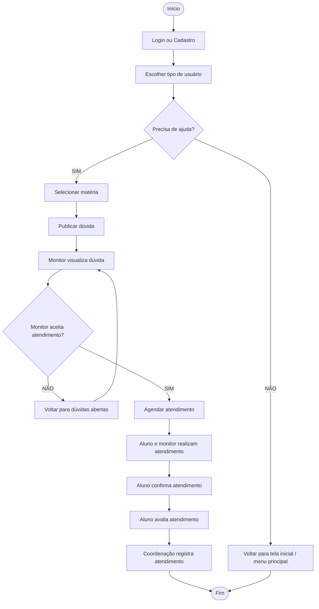
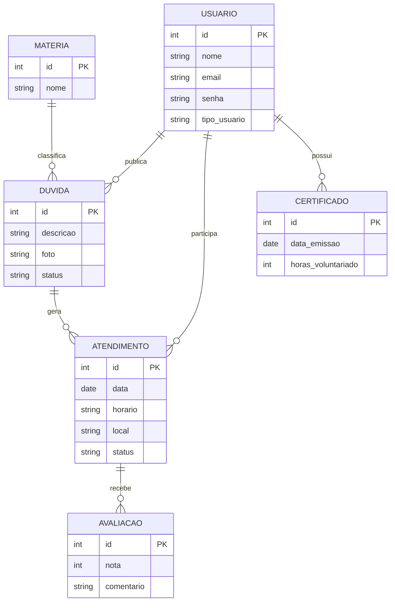

# Arquitetura da Solução — ConectaMente

## 1. Fluxo do sistema

## 2. Arquitetura da solução

A solução do ConectaMente é organizada para permitir que alunos encontrem ajuda em matérias nas quais possuem dúvidas, conectando-os com monitores disponíveis.

O sistema possui as seguintes partes principais:

- **Autenticação e cadastro:** permite que o usuário faça login ou crie uma conta no sistema.
- **Gerenciamento de usuários:** identifica o tipo de usuário, como aluno, monitor ou coordenação.
- **Gerenciamento de matérias:** mantém as matérias disponíveis para que o aluno escolha aquela relacionada à sua dúvida.
- **Gerenciamento de dúvidas:** permite que o aluno publique uma dúvida e acompanhe seu atendimento.
- **Gerenciamento de atendimentos:** permite que um monitor aceite uma dúvida e seja realizado o agendamento do atendimento.
- **Avaliação:** permite que o aluno avalie o atendimento realizado.
- **Coordenação:** registra e acompanha os atendimentos realizados e as atividades dos monitores.
- **Banco de dados:** armazena usuários, dúvidas, matérias, atendimentos e avaliações.

## 3. Modelo de dados

## 4. Justificativa das escolhas

- **Usuário:** pessoa cadastrada no sistema, podendo ser estudante ou monitor.
- **Dúvida:** pergunta publicada por um usuário e relacionada a uma matéria.
- **Matéria:** categoria ou disciplina à qual uma dúvida pertence.
- **Atendimento:** encontro presencial ou online criado a partir de uma dúvida aceita por um monitor.
- **Avaliação:** nota e comentário dados pelo usuário após o atendimento.
- **Certificado:** registra a participação e as horas de voluntariado do usuário.
- **Banco de dados:** armazena e organiza as informações necessárias para o funcionamento do sistema.

## 5. Funcionamento geral

O funcionamento do ConectaMente começa com o usuário realizando o login ou cadastro. Depois, ele escolhe seu tipo de usuário.

Quando um aluno precisa de ajuda, seleciona a matéria relacionada à dúvida e publica sua pergunta. Um monitor pode visualizar as dúvidas abertas e aceitar um atendimento.

Após a aceitação, o atendimento é agendado e realizado entre o aluno e o monitor. Ao final, o aluno confirma e avalia o atendimento. A coordenação registra o atendimento concluído.

O objetivo do ConectaMente é facilitar a comunicação entre alunos e monitores, criando um espaço organizado para tirar dúvidas e incentivar o aprendizado entre os estudantes.
